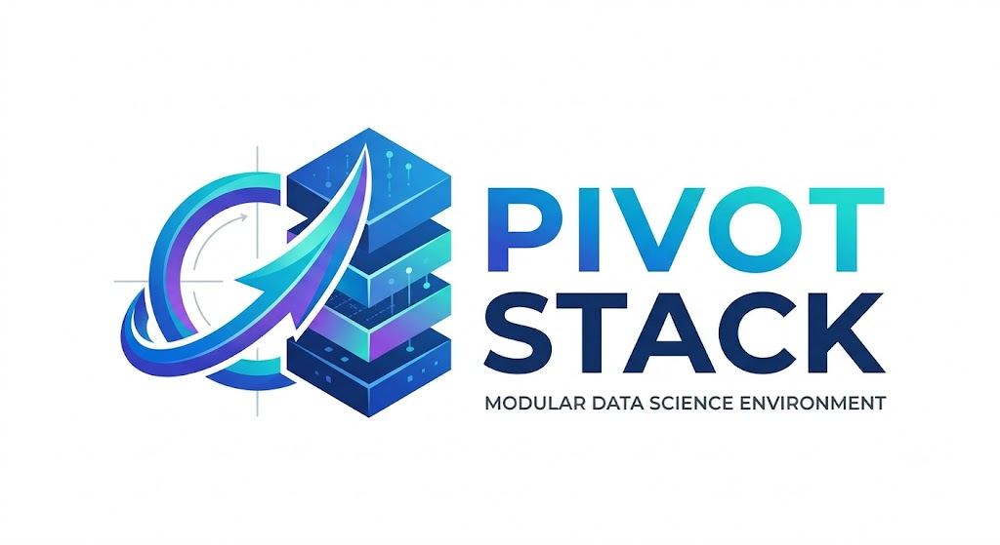

<p align="center">
  
</p>

# Pivot Stack

A highly modular, reproducible, and containerized data science infrastructure. Built for performance and clean engineering, Pivot Stack provides a terminal-first environment isolated via Podman and automated via GitHub Actions.


Just pull the OCI container with `podman pull ghcr.io/kkroesch/pivot-stack`. More hints how to start are found in the `Justfile`.

## 🧰 Core Stack & Tools

This environment strictly separates system dependencies from project environments, relying on fast, modern CLI tools:

* **[uv](https://github.com/astral-sh/uv)**: An extremely fast Python package and project manager, written in Rust.
* **[marimo](https://marimo.io/)**: A reactive Python notebook environment that guarantees reproducible experiments.
* **[DuckDB](https://duckdb.org/)**: An in-process SQL OLAP database management system for fast data analytics.
* **[DVC (Data Version Control)](https://dvc.org/)**: An open-source version control system specifically designed for datasets and machine learning models.
* **[VisiData](https://visidata.org/)**: A fast, versatile terminal-based spreadsheet and data exploration tool.
* **[AstroNvim](https://astronvim.com/)**: A highly customizable and feature-rich Neovim configuration for efficient terminal-based coding.
* **[fish shell](https://fishshell.com/)** & **[Starship](https://starship.rs/)**: A smart, user-friendly command-line shell paired with a blazing-fast, customizable prompt.
* **[just](https://github.com/casey/just)**: A handy command runner to manage build tasks and container orchestration.

## 🚀 Getting Started

Build and run the container locally using Podman:

```bash
# Build the image
podman build -t pivot-stack:local .

# Run the interactive environment
podman run -it --rm \
        -p 2718:2718 \
        -v "$PWD":/workspace:Z \
        -w /workspace \
        pivot-stack \
        marimo edit --host 0.0.0.0 --port 2718 --headless --no-token notebook.py
```

